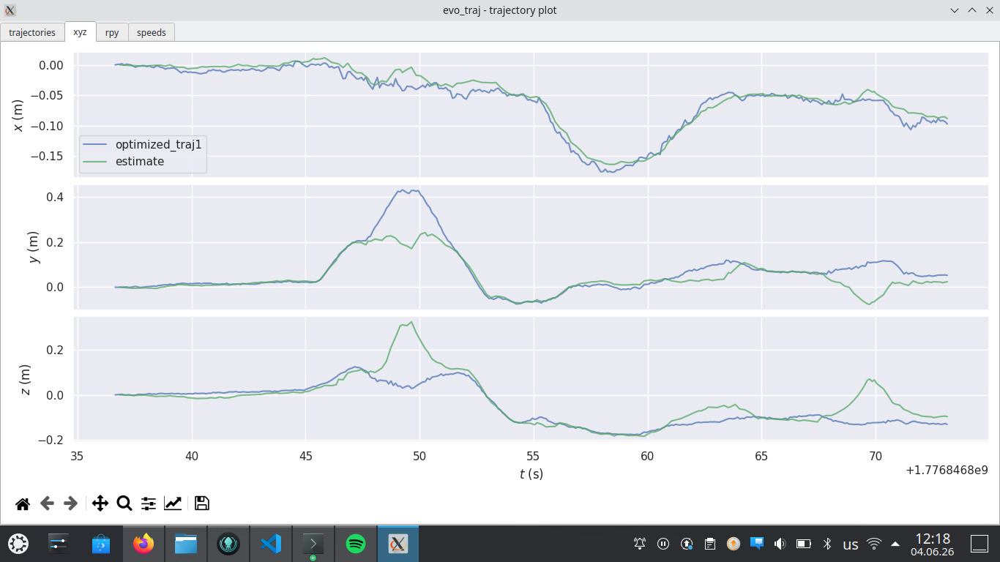
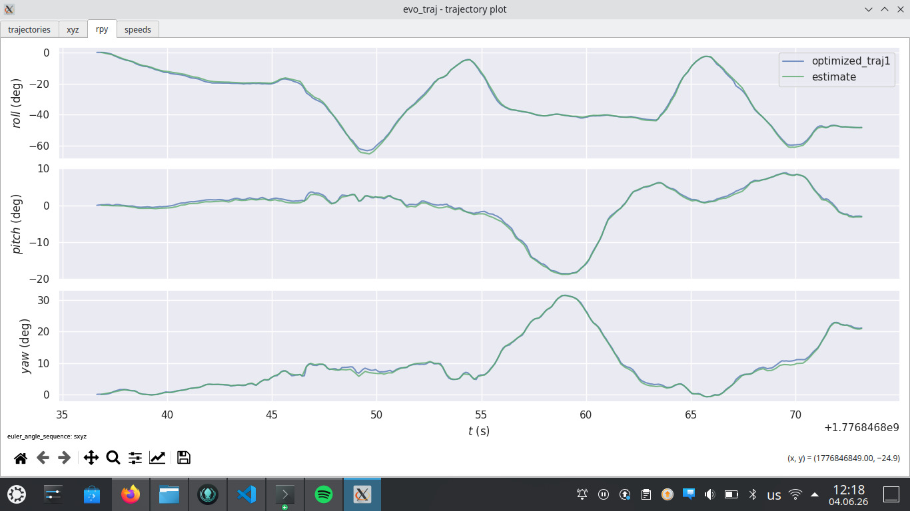
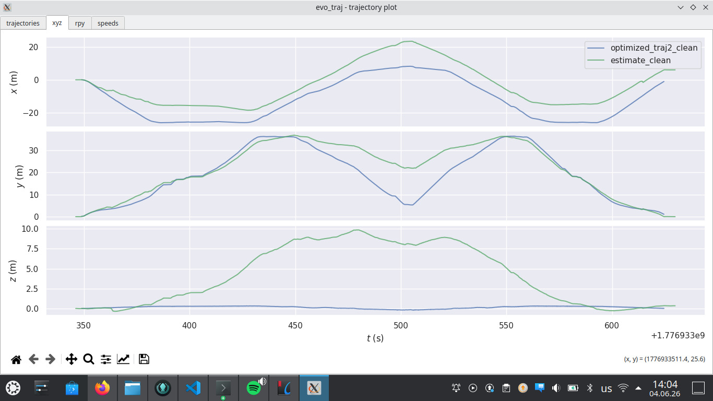
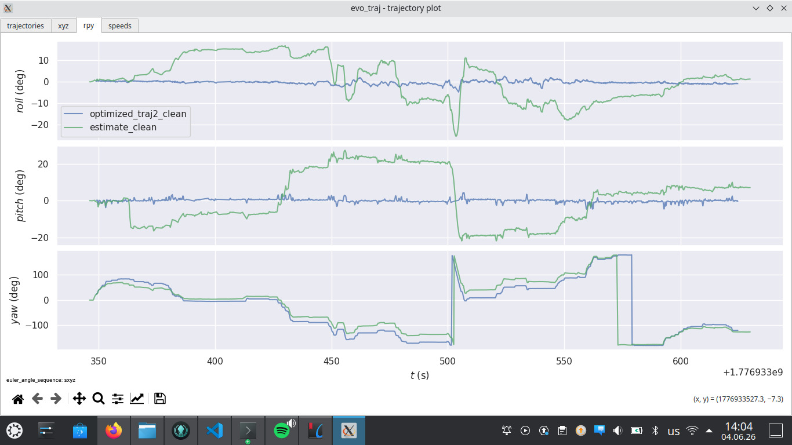
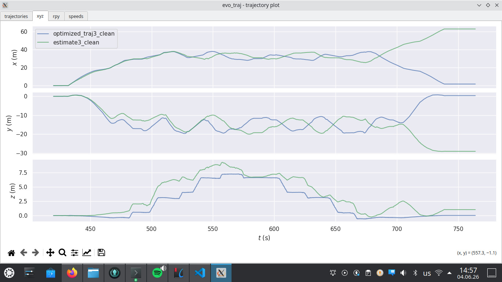
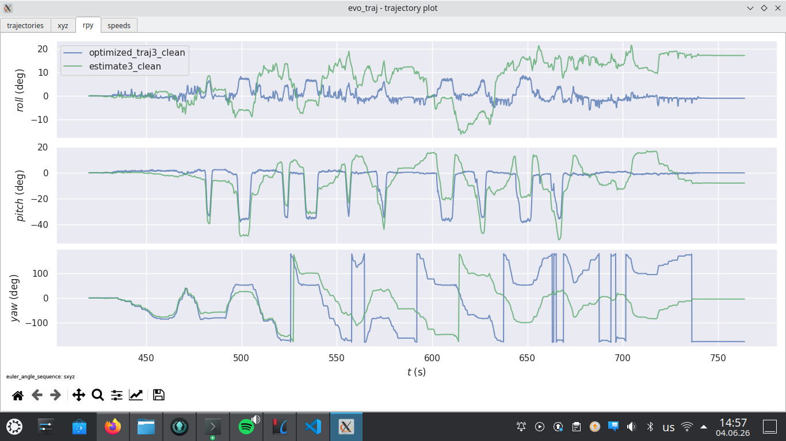

# 3D LiDAR Odometry

ROS2 package with a custom implementation of a 3D LiDAR Odometry using point-to-plane Iterative Closest Point and a KD-Tree nearest neighbor search with Maximum spread-based split.

## Requirements

- Ubuntu 22.04
- ROS2 Humble
- Eigen3

## Build
The following commands are used to build the project:

```bash
cd ~/ros2_ws
colcon build --packages-select st199010 --executor sequential
```

To run the Unit Tests:
```bash
colcon test --packages-select st199010 --executor sequential
```

## Run the project
To run the project, a launch file was implemented. It can be executed with the following command:

```bash
ros2 launch st199010 odom.launch.py useRviz:=true logLevel:=debug
```

## Run the rosbag
Given the datasets provided in classroom for testing the project, the following command was used to run the bags in another terminal:

```bash
ros2 bag play . --clock -r 0.2
```

## Odometry evaluation
To evaluate how good is the odometry, evo tool was used to generate graphs of the estimated trajectory vs. the ground truth.
These graphs were obtained using a command like this one:

```bash
evo_traj tum optimized_traj.txt estimate.txt --plot --plot_mode xy
```

The following are the results obtained for each one of the three datasets provided:

# Dataset1:



# Dataset2:



# Dataset3:



## Note:
Several parameters (such as the ones in the file params.yaml) can still be modified and tuned to get better overall results.